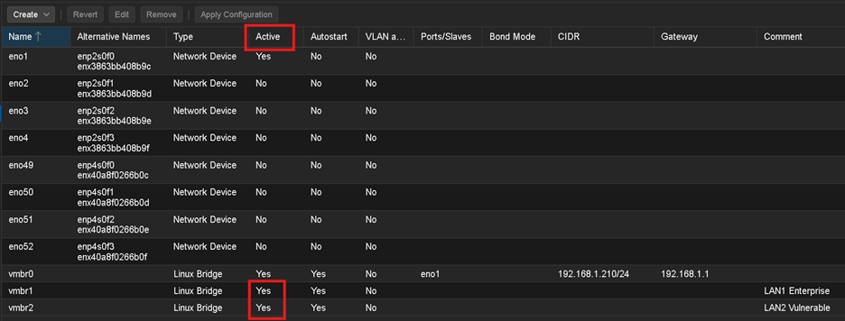
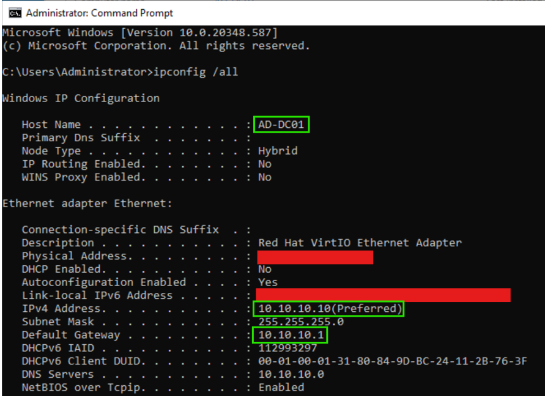
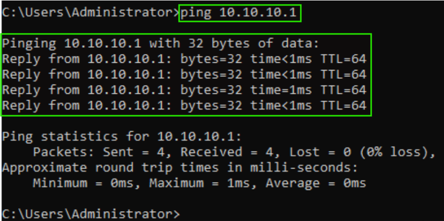
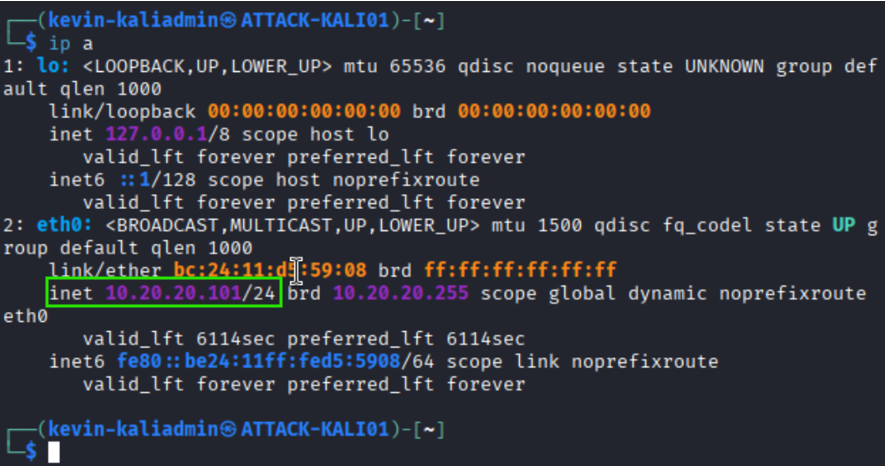
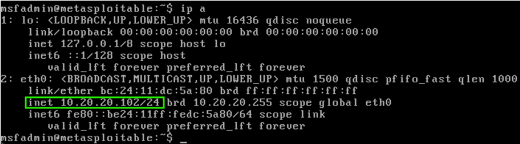

# P1-1: Proxmox Segmentation Lab

## Overview
This repo documents a segmented Proxmox homelab designed to mimic an enterprise environment. The lab uses **pfSense as the edge firewall/router** with **multiple Proxmox bridges** to separate traffic into distinct security zones (**LAN1 Enterprise** vs **LAN2 Vulnerable**), enabling realistic security testing, monitoring, and containment scenarios.

## Lab Build Guide
For step-by-step implementation, start here:

[docs/00-lab-guide.md](docs/00-lab-guide.md)

## Sanitization Note
To reduce risk, this repo uses **representative** IP ranges, hostnames, and identifiers.  
Architecture, workflows, and security controls are accurate, but specific values may be modified for privacy and security.

## Objectives
- Build a lab with **network segmentation** and **least privilege** routing between zones
- Implement **pfSense** routing and firewall policy between zones
- Maintain a reusable VM layout for SOC / blue-team and vulnerable-testing workflows
- Provide clear documentation and screenshots for reproducibility

## Current Progress

> Status: Week 5 complete. The segmented lab now includes a working pfSense edge router, an enterprise server on LAN1, an attack and vulnerable segment on LAN2, and a Splunk server on LAN1.
>
> Completed:
> - Proxmox bridge design documented
> - pfSense VM created in Proxmox
> - Interface mapping established:
>   - WAN -> vmbr0
>   - LAN1 -> vmbr1
>   - LAN2 -> vmbr2
> - Web UI access confirmed
> - Interface behavior validated
> - DHCP configured for LAN1 and LAN2
> - `AD-DC01` deployed on LAN1 with static IP and validated connectivity
> - `ATTACK-KALI01` deployed on LAN2
> - `VULN-METASPLOITABLE2` deployed on LAN2
> - LAN2 communication validated between Kali and Metasploitable
> - `SIEM-SPLUNK01` deployed on LAN1
> - Ubuntu Server installed and statically addressed for Splunk
> - Splunk installed and Web UI access confirmed
>
> Next:
> - Begin log forwarding into Splunk
> - Validate initial log ingestion
> - Continue documenting screenshots and build notes for later phases

## Milestone Tracker

- [x] Week 1: Proxmox bridges and pfSense deployment
- [x] Week 2: WAN/LAN validation, web UI access, and DHCP
- [x] Week 3: First Windows VM connected to LAN1
- [x] Week 4: Kali and vulnerable VM base connectivity
- [x] Week 5: Splunk deployment

## Network Diagram

**Design intent:** `FW-EDGE01` (pfSense) provides WAN access and acts as the central routing and segmentation point between **LAN1 (enterprise / blue-team)** and **LAN2 (vulnerable / testing)**.

## High-Level Architecture

### Zones
- **WAN (`vmbr0`)**: home uplink, used only by pfSense WAN
- **LAN1 Enterprise (`vmbr1`)**: AD, endpoints, and SIEM tooling
- **LAN2 Vulnerable (`vmbr2`)**: intentionally vulnerable systems and scanners

### Edge
- **`FW-EDGE01` (pfSense)**:
  - NIC1 → `vmbr0` (WAN)
  - NIC2 → `vmbr1` (LAN1 Enterprise)
  - NIC3 → `vmbr2` (LAN2 Vulnerable)

## IP Plan (Representative)

| Zone | Subnet | Gateway | Notes |
|------|--------|---------|------|
| WAN | Upstream DHCP | — | pfSense WAN only |
| LAN1 (Enterprise) | `10.10.10.0/24` | `10.10.10.1` | AD, endpoints, monitoring |
| LAN2 (Vulnerable) | `10.20.20.0/24` | `10.20.20.1` | Vulnerable targets and testing |

Full details: [IP Addressing](docs/ip-addressing.md)

## Supporting Documentation
- [Proxmox Bridges](docs/proxmox-bridges.md)
- [pfSense Configuration](docs/pfsense-config.md)
- [VM Inventory](docs/vm-inventory.md)
- [Build Notes](docs/build-notes.md)

## Firewall Policy
Firewall policy implementation is planned and will be validated after pfSense web UI access and interface testing are completed.

Target model:
- LAN1 → WAN: allow
- LAN2 → WAN: restricted allow or deny depending on scenario
- LAN2 → LAN1: deny by default
- LAN1 → LAN2: limited allow for admin/testing workflows only

Planned documentation:
- [Firewall Policy](docs/firewall-policy.md)

## Current Evidence

### Proxmox Bridge Layout

### pfSense Installation

### pfSense Interface Assignment

### pfSense Console Interfaces

### pfSense Web UI and DHCP Validation

### Week 3 - AD-DC01 Deployment and Connectivity

### Week 4 - LAN2 Attack Lab Base

### Week 5 - Splunk Deployment

## Build Sequence (High Level)
1. Create Proxmox bridges: `vmbr0` (WAN), `vmbr1` (LAN1), `vmbr2` (LAN2)
2. Deploy pfSense VM with 3 NICs mapped to those bridges
3. Configure pfSense interfaces and DHCP scopes for LAN1/LAN2
4. Apply firewall rules to enforce segmentation
5. Deploy VMs into LAN1 or LAN2 per inventory

## What’s Next
This repo is the foundation for P1-2:
- centralized telemetry pipelines (`WEF/Sysmon → Wazuh/Elastic/Splunk`)
- attack simulation and investigation case files using segmented zones
