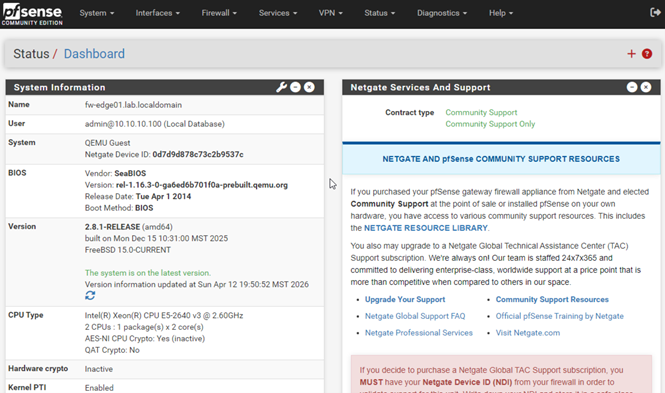
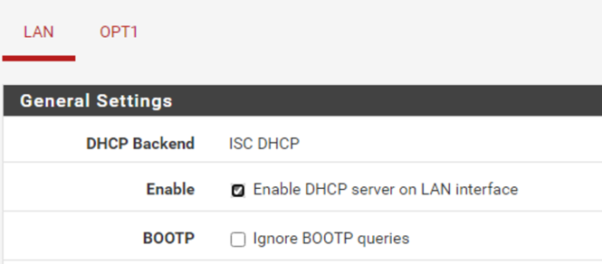
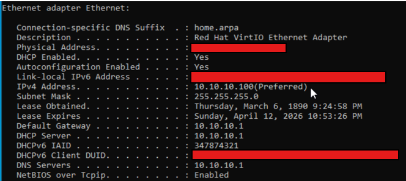

# pfSense Configuration

## Status
- **Deployed in Proxmox:** April 6, 2026
- **Week 2 configuration completed:** April 13, 2026

## Purpose
`FW-EDGE01` serves as the lab’s edge firewall/router and enforces segmentation between the WAN, Enterprise LAN, and Vulnerable LAN.

## Interface Mapping
- WAN -> `vmbr0`
- LAN1 -> `vmbr1`
- LAN2 / OPT1 -> `vmbr2`

## Initial Interface IPs
- WAN: upstream/home router via `vmbr0` (DHCP)
- LAN1: `10.10.10.1/24`
- LAN2 / OPT1: `10.20.20.1/24`

## Current State
- pfSense VM has been successfully deployed in Proxmox
- Interfaces were assigned and verified from the pfSense console
- WAN received an upstream address from the home router
- LAN1 and LAN2 were configured with initial gateway addresses for internal lab routing
- WebConfigurator access was validated from the internal network
- DHCP services were configured for LAN1 and LAN2
- LAN1 client lease validation was confirmed using `AD-WIN10`

## Week 2 Validation Summary
Week 2 focused on making `FW-EDGE01` operational as a usable segmented lab gateway. This included validating web management access, enabling DHCP services, and confirming that an internal endpoint on LAN1 received a lease from pfSense with the expected gateway and DNS settings.

## Notes
- pfSense is acting as the routing and segmentation point between all three zones
- Base deployment, interface assignment, web UI validation, and DHCP setup are complete
- Early client validation has been completed on LAN1
- Additional client validation, firewall rule implementation, and later service integrations will continue in upcoming phases

## Evidence

### Base Deployment

### Week 2 Web UI and DHCP Validation

