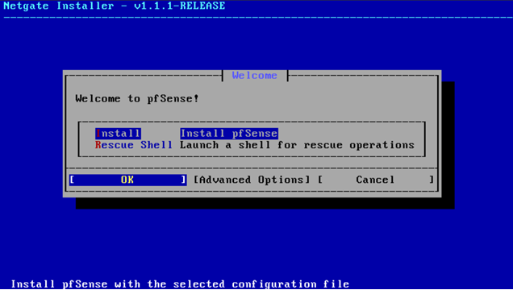
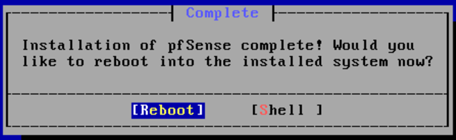
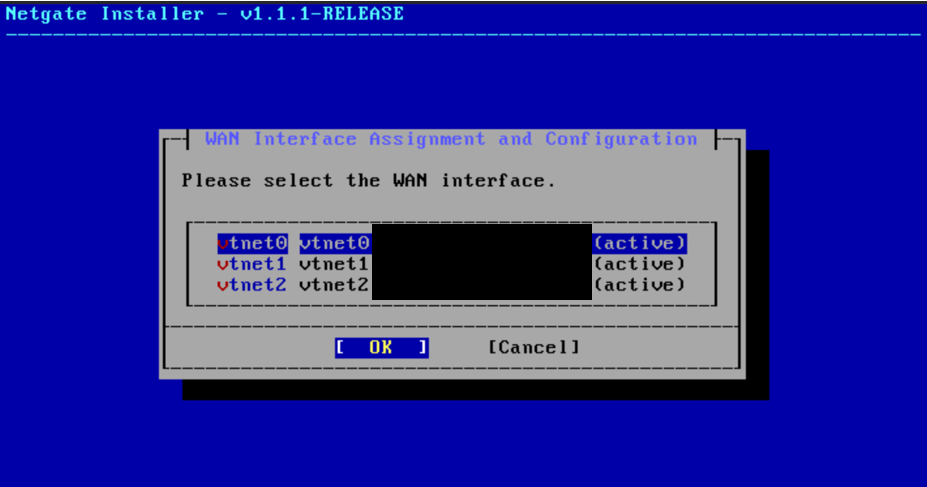
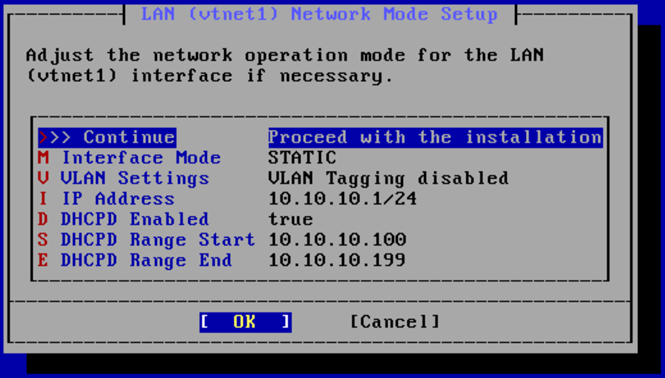
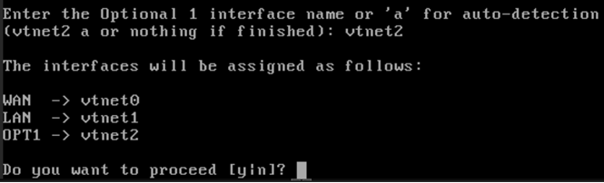
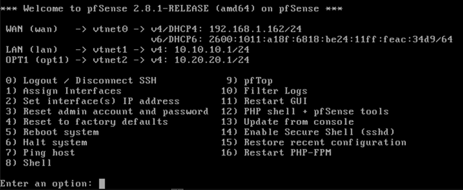

# pfSense Configuration

## Status
- Week 1 deployed in Proxmox on April 6, 2026 as `FW-EDGE01`.
- Week 2 focuses on validating interface assignments, confirming LAN addressing, and preparing DHCP-backed connectivity for internal lab systems.

## Purpose
FW-EDGE01 serves as the lab’s edge firewall/router and enforces segmentation between the WAN, Enterprise LAN, and Vulnerable LAN.
- `LAN1` — Enterprise / Blue Team zone
- `LAN2` — Vulnerable / Testing zone

## Interface Mapping
- WAN -> `vmbr0`
- LAN1 -> `vmbr1`
- LAN2 / OPT1 -> `vmbr2`

## Initial Interface IPs
- WAN: upstream/home router via `vmbr0` (DHCP)
- LAN1: `10.10.10.1/24`
- LAN2 / OPT1: `10.20.20.1/24`

## Current State
- pfSense VM has been successfully deployed in Proxmox
- Interfaces have been assigned and verified from the pfSense console
- WAN received an upstream address from the home router
- LAN1 and LAN2 were configured with initial gateway addresses for internal lab routing

## Week 2 Configuration Goals

- [x] Validate pfSense boots successfully
- [x] Confirm interface assignments match design
- [ ] Access pfSense web UI
- [ ] Confirm LAN1 interface IP configuration
- [ ] Confirm LAN2 interface IP configuration
- [ ] Configure DHCP for LAN1
- [ ] Configure DHCP for LAN2
- [ ] Prepare first internal endpoint connectivity on LAN1

## Notes
- pfSense is acting as the routing and segmentation point between all three zones.
- WAN connects upstream through the home network on `vmbr0`.
- Internal lab traffic for enterprise and vulnerable segments will route through pfSense.
- DHCP and endpoint validation are part of the active Week 2 build process.

## Evidence

